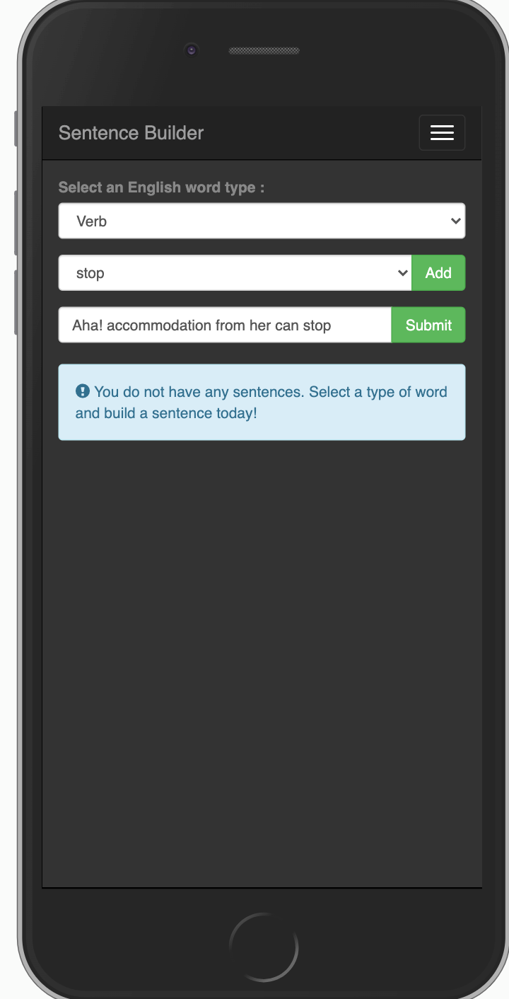

# sentence-builder-app
Simple AngularJS Web application that allows users to build sentences based on different parts of speech in the English language

This is a  sentence builder  app that works together with a NodeJS backend [sentence-builder-api](https://github.com/tevin-morake/sentence-builder-api)


## Get started

### Clone the repo

```shell
git clone https://github.com/tevin-morake/sentence-builder-app/git
cd sentence-builder-app
```
#Prerequisite's
### Install bower to manage our packages
* Install the `bower` -  packages :  angular, angular-animate, angular-route, angular-strap:
```shell
npm install -g bower
# install a package and add it to bower.json 
$ bower install angular --save
```
* Download bootstrap 3.x
### Install lite-server & run app locally on port 3000
``` shell
npm install -g lite-server
`lite-server` .
```
Shut it down manually with `Ctrl-C`.

#### views

These are the views used in this ap:
* `index.html` - 
* `sentence.html` - 
* `splash.html` -

